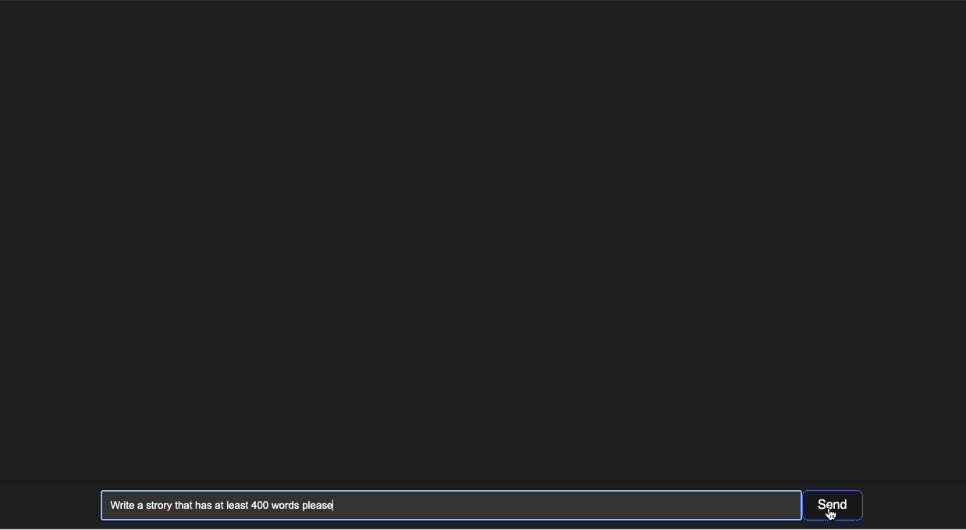
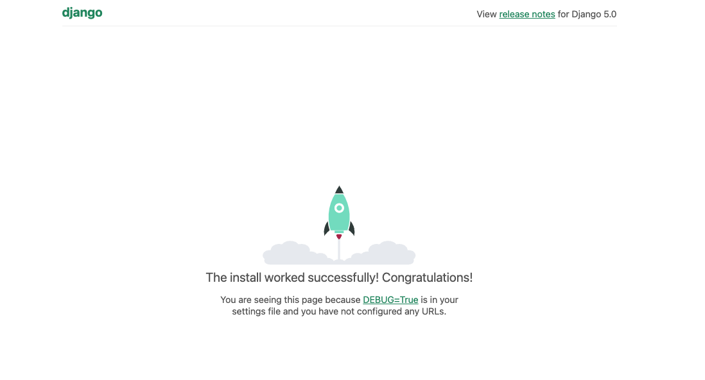
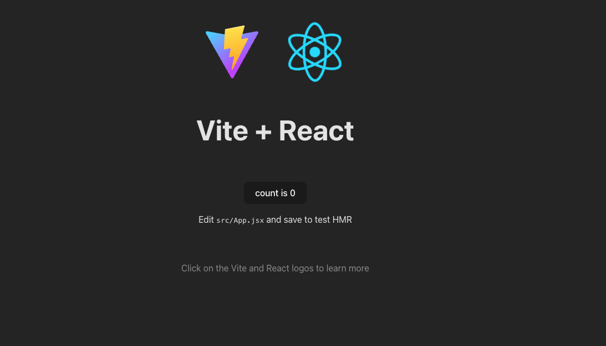
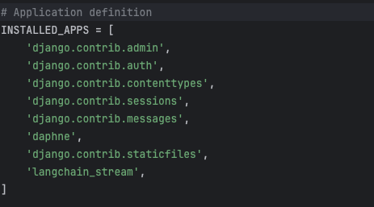

# Real-time LangChain Streaming with Django and React Tutorial

<br/><br/>

### Step-by-step tutorial for streaming LLM output via LangChain, Django, and React.

<br/><br/>

> [!NOTE]
> You can find the [GitHub Project Page here](https://github.com/Otokpa/Django_React_Langchain_Stream).

<br/><br/>




## 🚀 Setting Up the Backend with Django

-----
### Install Django

- Open your terminal or command prompt and run:

  ```bash
  pip install django
  ```

### Create Your Django Project

- Navigate to your desired project directory and run:

  ```bash
  django-admin startproject Django_React_Langchain_Stream
  ```

- Move into the project directory:

  ```bash
  cd Django_React_Langchain_Stream
  ```
---

### Virtual Environment Setup

- install `virtualenv` (if you haven't already):

  ```bash
  pip install virtualenv
  ```

- Create and Activate a Virtual Environment in the project directory

  Create:
  ```
  virtualenv venv
  ```
  
  Activate:

  On Mac/Linux:

  ```bash
  source venv/bin/activate
  ```
  
  On Windows:

  ```bash
  venv\Scripts\activate
  ```

---

### Create Your Django App

- Install Django in the Virtual Environment:

  ```bash
  pip install Django==5.0.3
  ```


- Create a Django App named: `langchain_stream`

  ```bash
  python manage.py startapp langchain_stream
  ```

---
### Test the Setup

- Start the Django development server:

    ```bash
    python manage.py runserver
    ```
  Visit http://127.0.0.1:8000/ in your browser to see the Django welcome page.

  

  Stop the server with `CONTROL-C`.

# 🔧 Frontend Setup with React

---
### Prerequisites

- **Ensure `Node.js` and `npm` are installed:

  run:
- 
  ```bash
  node -v
  npm -v
  ```
  
  if installed, you should see the version numbers.

  ```
  v20.8.0
  10.1.0
  ```
  
  If not installed, download them from [the official Node.js website](https://nodejs.org/).

---

### Create a React Application

- Generate a new React project:

  ```
  npm create vite@latest
  ```
  
  Name the project `frontend`, select 'React' as the framework, and choose 'JavaScript' for the variant. Then, navigate into your new frontend directory:
  
  ```bash
  cd frontend
  ``` 
   
  Install the required React packages:
  
  ```bash
  npm install
  ```
  
---
  ### Test the Frontend
  
- Start the React development server:

  ```bash
  npm run dev
  ```
  
  Visit the URL shown in your terminal (usually http://localhost:5173/) to view your React app's welcome page.
  
  Use `CONTROL-C` to stop the server.

  After completing the setup and installations, your project directory should look like this:
  ```
  Django_React_Langchain_Stream/
  ├── Django_React_Langchain_Stream/
  ├── frontend/
  ├── langchain_stream/
  ├── venv/
  ├── db.sqlite3
  └── manage.py
  ```

---
## Bridging Django and React with Websockets

You can now open the project `Django_React_Langchain_Stream` in your IDE.

---
### API key Setup

- Begin by creating an `.env` file at the root of your Django project to securely store your Openai API key:

  add the following line to the `.env` file:

  ```bash
  OPENAI_API_KEY=12345678-abcd-1234-ef00-1234567890ab-this-is-a-fake-api-key
  ```
  
  Replace the value with your actual Openai API key.
  
> [!WARNING]
> Never commit your `.env` file to a public repository.

---
### 🔧 Configure the Django settings.py for Websockets

- In `settings.py`, add `langchain_stream` and `daphne` to `INSTALLED_APPS`:

  ```python
  'daphne',
  # ...,
  'langchain_stream',
  ```

> [!WARNING]
> Daphne must be listed before `django.contrib.staticfiles` in INSTALLED_APPS.

  

- Replace the WSGI application line with an ASGI configuration to enable asynchronous communication.

  Remove or comment out the line:

  ```python
  # WSGI_APPLICATION = ' Django_React_Langchain_Stream.wsgi.application'
  ```
  
  Add the following ASGI configuration line:

  ```python
  ASGI_APPLICATION = "Django_React_Langchain_Stream.asgi.application"
  ```

---
### Create the views.py file

- Install LangChain and related packages for LLM integration and websocket support:

  In the terminal, run:

  ```bash
  pip install langchain==0.1.11 langchain-community==0.0.26 langchain-openai==0.0.8 channels==4.0.0 daphne==4.1.0 python-dotenv==1.0.1
  ```

  In langchain_stream/views.py, replace with the following code:

  ```python
  from langchain_openai import ChatOpenAI
  from langchain_core.prompts import ChatPromptTemplate
  from langchain_core.output_parsers import StrOutputParser
  from channels.generic.websocket import AsyncWebsocketConsumer
  import json
  from dotenv import load_dotenv
  
  load_dotenv('.env')
  
  prompt = ChatPromptTemplate.from_messages([
      ("system", "You are a helpful assistant."),
      ("user", "{input}")
  ])
  
  llm = ChatOpenAI(model="gpt-3.5-turbo-0125")
  
  output_parser = StrOutputParser()
  # Chain
  chain = prompt | llm.with_config({"run_name": "model"}) | output_parser.with_config({"run_name": "Assistant"})
  
  
  class ChatConsumer(AsyncWebsocketConsumer):
  
      async def connect(self):
          await self.accept()
  
      async def disconnect(self, close_code):
          pass
  
      async def receive(self, text_data):
          text_data_json = json.loads(text_data)
          message = text_data_json["message"]
  
          try:
              # Stream the response
              async for chunk in chain.astream_events({'input': message}, version="v1", include_names=["Assistant"]):
                  if chunk["event"] in ["on_parser_start", "on_parser_stream"]:
                      await self.send(text_data=json.dumps(chunk))
  
          except Exception as e:
              print(e)
  ```


<details>
<summary> Insight into this views.py code </summary>
The frontend establishes a WebSocket connection to the backend. This connection is used to send the user's input and receive streamed responses.

this chain in the for loop:
```python
# Define the output parser
output_parser = StrOutputParser()
# Define the processing chain
chain = prompt | llm.with_config({"run_name": "model"}) | output_parser.with_config({"run_name": "Assistant"})

async for chunk in chain.astream_events({'input': message}, version="v1", include_names=["Assistant"]):
    if chunk["event"] in ["on_parser_start", "on_parser_stream"]:
        await self.send(text_data=json.dumps(chunk))
```

ouputs these chunks:

```python
{'event': 'on_parser_start', 'name': 'Assistant', 'run_id': '6150f5ac-30b4-48ba-a2f3-361638bf02a6', 'tags': ['seq:step:3'], 'metadata': {}, 'data': {}}
{'event': 'on_parser_stream', 'name': 'Assistant', 'run_id': '6150f5ac-30b4-48ba-a2f3-361638bf02a6', 'tags': ['seq:step:3'], 'metadata': {}, 'data': {'chunk': ''}}
{'event': 'on_parser_stream', 'name': 'Assistant', 'run_id': '6150f5ac-30b4-48ba-a2f3-361638bf02a6', 'tags': ['seq:step:3'], 'metadata': {}, 'data': {'chunk': 'Hello'}}
...,
{'event': 'on_parser_stream', 'name': 'Assistant', 'run_id': '6150f5ac-30b4-48ba-a2f3-361638bf02a6', 'tags': ['seq:step:3'], 'metadata': {}, 'data': {'chunk': ''}}
{'event': 'on_parser_end', 'name': 'Assistant', 'run_id': '6150f5ac-30b4-48ba-a2f3-361638bf02a6', 'tags': ['seq:step:3'], 'metadata': {}, 'data': {'input': AIMessageChunk(content='Hello! I am a message. How can I assist you today?'), 'output': 'Hello! I am a message. How can I assist you today?'}}
```

These chunks are divided into different `event` types: `on_parser_start`, `on_parser_stream`, and `on_parser_end`, which the frontend handles to update the chat interface in real-time.

1. `on_parser_start`: This event signifies the start of a new message stream. The frontend initializes a tracker for the message's content, preparing to display the incoming response piece by piece.

2. `on_parser_stream`: As the backend processes the input, it streams back chunks of the response. Each chunk is appended to the ongoing message's content, allowing the response to appear gradually on the screen. This gives users a visual indication that their input is being processed.

3. `on_parser_end`: This event indicates the end of the response stream. While not directly handled in the provided frontend code, it signifies that the full response has been delivered. In practice, this could be used to trigger additional UI updates, such as indicating that the chatbot is ready for more input.

For more information on the LangChain Streaming options, see the [Streaming With LangChain documentation](https://python.langchain.com/docs/expression_language/streaming).
</details>


---
### Set Up Websocket Routing

- Define how websocket connections are handled by creating `routing.py` and `urls.py` in your `langchain_stream` app.

  Create the file: `langchain_stream/routing.py`,and add the following code:

  ```python
  from django.urls import re_path  
  from . import views  
    
  websocket_urlpatterns = [  
      re_path(r'ws/chat/$', views.ChatConsumer.as_asgi()),  
  ]
  ```
  
  Create the file: `langchain_stream/urls.py`,and add the following code:

  ```python
  from django.urls import path  
  from . import views  
    
    
  urlpatterns = [  
      path('ws/chat/', views.ChatConsumer.as_asgi()),  
  ]
  ```
  
  Replace the code in `Django_React_Langchain_Stream/asgi.py` with the following:

  ```python
    
  import os  
  from django.core.asgi import get_asgi_application  
  from channels.routing import ProtocolTypeRouter, URLRouter  
  from channels.auth import AuthMiddlewareStack  
  import langchain_stream.routing  
    
  os.environ.setdefault('DJANGO_SETTINGS_MODULE', 'Django_React_Langchain_Stream.settings')  
    
  application = ProtocolTypeRouter({  
    "http": get_asgi_application(),  
    "websocket": AuthMiddlewareStack(  
          URLRouter(  
              langchain_stream.routing.websocket_urlpatterns  
          )  
      ),  
  })
  ```
  
---
### Integrate with React

- Replace the code in `frontend/src/App.js` with the following:

  ```javascript
  import React, { useState, useEffect, useRef } from 'react';
  import './App.css';
  
  const StreamLangchain = () => {
      // State to store the input from the user
      const [input, setInput] = useState('');
      // State to store the responses/messages
      const [responses, setResponses] = useState([]);
      // Ref to manage the WebSocket connection
      const ws = useRef(null);
      // Ref to scroll to the latest message
      const messagesEndRef = useRef(null);
      // Maximum number of attempts to reconnect
      const [reconnectAttempts, setReconnectAttempts] = useState(0);
      const maxReconnectAttempts = 5;
  
      // Function to setup the WebSocket connection and define event handlers
      const setupWebSocket = () => {
          ws.current = new WebSocket('ws://127.0.0.1:8000/ws/chat/');
          let ongoingStream = null; // To track the ongoing stream's ID
  
          ws.current.onopen = () => {
              console.log("WebSocket connected!");
              setReconnectAttempts(0); // Reset reconnect attempts on successful connection
          };
  
          ws.current.onmessage = (event) => {
              const data = JSON.parse(event.data);
              let sender = data.name;
  
              // Handle different types of events from the WebSocket
              if (data.event === 'on_parser_start') {
                  // When a new stream starts
                  ongoingStream = { id: data.run_id, content: '' };
                  setResponses(prevResponses => [...prevResponses, { sender, message: '', id: data.run_id }]);
              } else if (data.event === 'on_parser_stream' && ongoingStream && data.run_id === ongoingStream.id) {
                  // During a stream, appending new chunks of data
                  setResponses(prevResponses => prevResponses.map(msg =>
                      msg.id === data.run_id ? { ...msg, message: msg.message + data.data.chunk } : msg));
              }
          };
  
          ws.current.onerror = (event) => {
              console.error("WebSocket error observed:", event);
          };
  
          ws.current.onclose = (event) => {
              console.log(`WebSocket is closed now. Code: ${event.code}, Reason: ${event.reason}`);
              handleReconnect();
          };
      };
  
      // Function to handle reconnection attempts with exponential backoff
      const handleReconnect = () => {
          if (reconnectAttempts < maxReconnectAttempts) {
              let timeout = Math.pow(2, reconnectAttempts) * 1000; // Exponential backoff
              setTimeout(() => {
                  setupWebSocket(); // Attempt to reconnect
              }, timeout);
          } else {
              console.log("Max reconnect attempts reached, not attempting further reconnects.");
          }
      };
  
      // Effect hook to setup and cleanup the WebSocket connection
      useEffect(() => {
          setupWebSocket(); // Setup WebSocket on component mount
  
          return () => {
              if (ws.current.readyState === WebSocket.OPEN) {
                  ws.current.close(); // Close WebSocket on component unmount
              }
          };
      }, []);
  
      // Effect hook to auto-scroll to the latest message
      useEffect(() => {
          messagesEndRef.current?.scrollIntoView({ behavior: 'smooth' });
      }, [responses]);
  
      // Function to render each message
      const renderMessage = (response, index) => (
          <div key={index} className={`message ${response.sender}`}>
              <strong>{response.sender}</strong> <p>{response.message}</p>
          </div>
      );
  
      // Handler for input changes
      const handleInputChange = (e) => {
          setInput(e.target.value);
      };
  
      // Handler for form submission
      const handleSubmit = (e) => {
          e.preventDefault();
          const userMessage = { sender: "You", message: input };
          setResponses(prevResponses => [...prevResponses, userMessage]);
          ws.current.send(JSON.stringify({ message: input })); // Send message through WebSocket
          setInput(''); // Clear input field
      };
  
      return (
          <div className="chat-container">
              <div className="messages-container">
                  {responses.map((response, index) => renderMessage(response, index))}
                  <div ref={messagesEndRef} /> {/* Invisible element to help scroll into view */}
              </div>
              <form onSubmit={handleSubmit} className="input-form">
                  <input
                      type="text"
                      value={input}
                      onChange={handleInputChange}
                      placeholder="Type your message here..."
                  />
                  <button type="submit">Send</button>
              </form>
          </div>
      );
  };
  
  export default StreamLangchain;
  ```

### Add CSS Styling

- Replace the code in `frontend/src/App.css` with the following:

  ```css
  :root {
      --text-color: rgb(236, 236, 236);
      --background-color: rgb(33, 33, 33);
      --input-padding: 10px;
      --button-padding: 10px 20px;
  }
  
  body {
      margin: 0;
      font-family: "Source Sans Pro", sans-serif;
      font-weight: 400;
      line-height: 1.6;
      color: var(--text-color);
      background-color: var(--background-color);
      text-size-adjust: 100%;
      -webkit-tap-highlight-color: rgba(0, 0, 0, 0);
      -webkit-font-smoothing: auto;
  }
  
  .input-form {
      position: fixed;
      bottom: 0;
      left: 0;
      width: 100%;
      padding: 10px 0;
      display: flex;
      justify-content: center;
      align-items: center;
      box-shadow: 0 -2px 5px rgba(0,0,0,0.1);
  }
  
  input[type="text"] {
      width: 70%;
      padding: var(--input-padding);
  }
  
  button {
      padding: var(--button-padding);
  }
  
  .chat-container {
      display: flex;
      flex-direction: column;
      height: 100vh;
      padding: 6rem 5rem 10rem;
      box-sizing: border-box;
  }
  
  .messages-container {
      overflow-y: auto;
      max-height: calc(100vh - 3% - 100px);
      display: flex;
      flex-direction: column;
      align-items: center;
      position: absolute;
      top: 0;
      bottom: 100px;
      width: 100%;
      padding: 0 5rem;
      box-sizing: border-box;
  }
  
  .message {
      width: 60%;
      display: flex;
      flex-direction: column;
      gap: 0.5rem;
      padding: 1rem;
      border-radius: 0.5rem;
  }
  
  .message strong {
      margin-bottom: 4px;
      color: var(--text-color);
  }
  
  .message p {
      margin: 0;
  }
  ```

---
### All done! To run the application, start the Django server and the React development server:

- in 2 separate terminals, run:

  ```bash
  python manage.py runserver
  ``` 

  and

  ```bash
  cd frontend
  npm run dev
  ```
  Visit the URL shown in your terminal (usually http://localhost:5173/) to view the app.